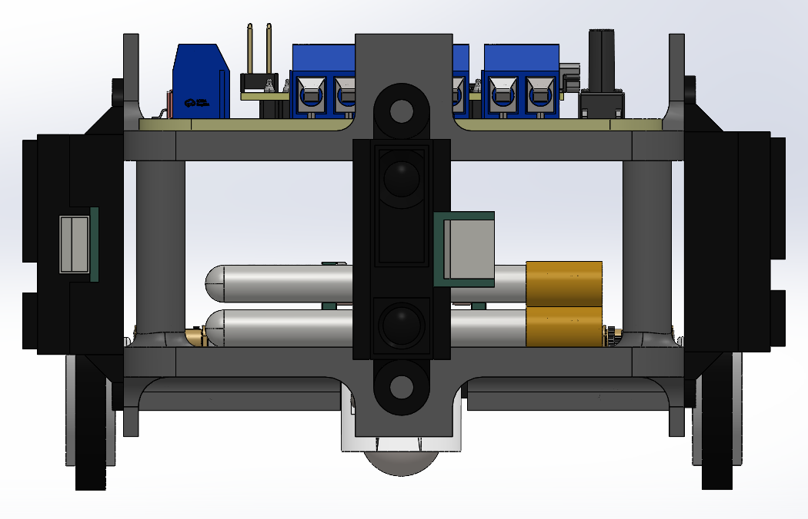
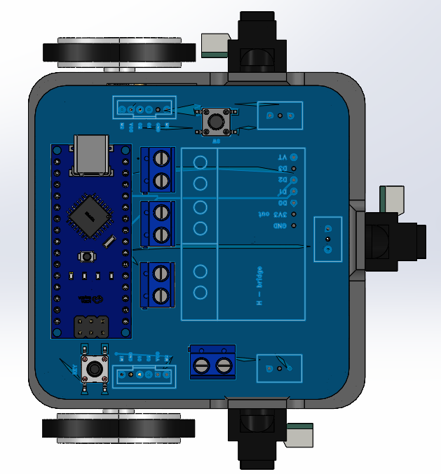
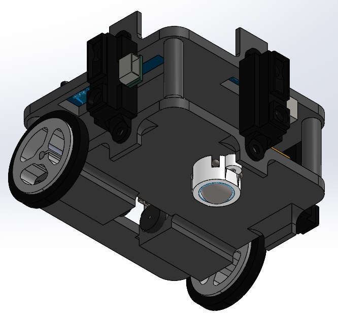
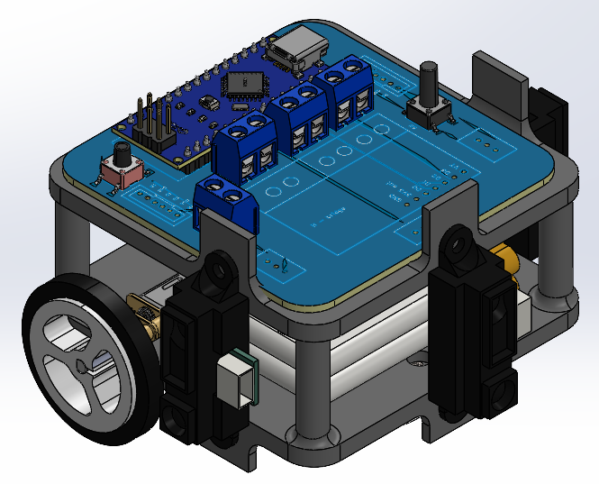

## Chassis Design

- **Material:** 3D-printed PLA for lightweight and durability  
- **Design Software:** SolidWorks (chassis)
- **Structure:** Two-layer square chassis, `7.5` cm × `7.5` cm; total height `5.5` cm (with `34` mm wheels and `1.5` cm castor wheel)
- **Assembly:** Layers fastened with screws and corner poles; motors and battery sandwiched between layers for balance
- **Mounting:** Motor cases and brackets on lower layer; castor wheel at front; battery on lower layer for mass balance; PCB (`7` cm ×`7` cm) fixed on upper layer
- **Sensors:** IR sensors vertically mounted on 3D-printed supports at front, left, and right, oriented per datasheet

## **Images:**

- **Front**&#x20; 

- **Top**&#x20;
  

- **Bottom**&#x20;
  

- **Side**&#x20;

