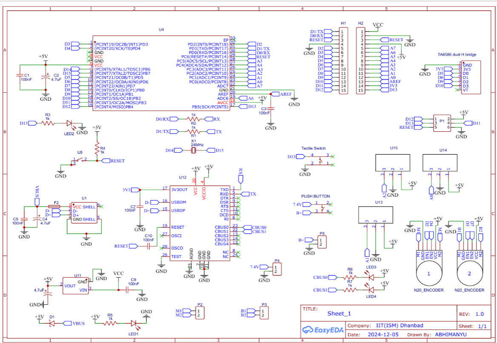

## Bill of Materials

| Item | Quantity | Description |
|------|----------|-------------|
| Arduino Nano | 1 | Microcontroller (ATmega328) |
| GP2Y0A41SK0F IR Sensor | 3 | Wall detection |
| TA6586 Motor Driver | 1 | Dual H-Bridge |
| 3.7V 1250mAh LiPo Battery | 2 | Power supply |
| N20 6V 500 RPM Encoder Motor | 2 | Locomotion & feedback |
| N20 Rubber Wheel | 2 | Movement |
| N20 Castor Ball Wheel | 1 | Front support |
| Custom PCB | 1 | Integration of all components |
| PLA Filament | - | 3D-printed chassis |

---

## Images

- **The schematics for the Custom Printed Circuit Board Designed**&#x20;

- **Upper side of PCB desing**&#x20;

- **Lower side of PCB desing**&#x20;

*See full component table in the report for detailed part numbers and specifications.*